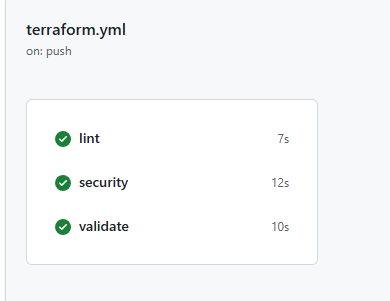
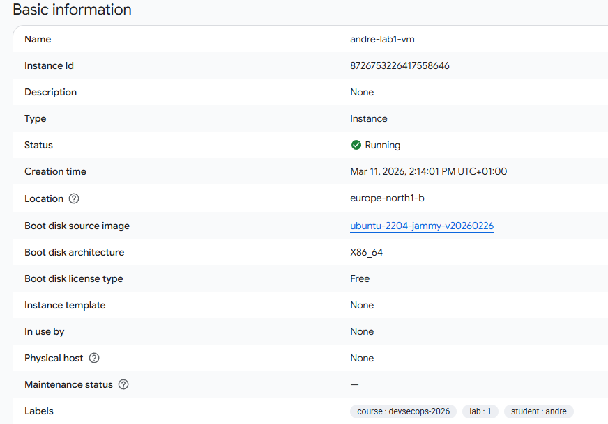

# Lab 1 Terraform

## Projektöversikt
Det här projektet provisionerar en Linux-VM i GCP med Terraform, hårdning via `startup.sh`, backup via snapshot policy och CI/CD via GitHub Actions.

## Checklista (G)
- [x] Terraform-kod som skapar Linux VM i GCP (`google_compute_instance`)
- [x] GitHub Actions med lint, security scan, validate
- [x] Backup-strategi i Terraform (daglig snapshot policy + retention)
- [x] README med förklaring och screenshots
- [ ] Minst en PR med synlig pipeline-körning i GitHub UI (behöver verifieras i repoets Pull Requests)

## Checklista (VG)
- [~] VM-härdning mot CIS (påbörjad i `startup.sh`, verifieras med Lynis på körande VM)
- [x] Pipeline blockerar CRITICAL (`trivy config --severity CRITICAL --exit-code 1 .`)
- [x] DR-dokumentation (RPO/RTO)
- [x] Remote state (GCS backend)
- [x] Auto-destroy workflow (`.github/workflows/destroy.yml`)

## Terraform och remote state
`main.tf` använder GCS-backend:

```hcl
terraform {
  backend "gcs" {
    bucket = "chas-tf-state-DITT-TEAM"
    prefix = "lab1/andre"
  }
}
```

Byt bucket-namn till ert riktiga team-bucket och kör sedan:

```bash
terraform init
```

Terraform migrerar då state till GCS.

## Köra lokalt

```bash
terraform init
terraform fmt -recursive
terraform validate
terraform plan
terraform apply
```

## CI Pipeline
Workflow: `.github/workflows/terraform.yml`

- `lint`: `terraform fmt -check -recursive`
- `security`: Trivy IaC scan som blockerar på CRITICAL
- `validate`: `terraform init -backend=false` + `terraform validate`
- `plan_apply`: manuell `workflow_dispatch` (optional apply)

### Screenshot - pipeline


## Auto-destroy
Workflow: `.github/workflows/destroy.yml`

- Trigger: `workflow_dispatch`
- Kör `terraform destroy -auto-approve` efter init och GCP-auth
- Kan enkelt kompletteras med schemaläggning (cron) för kostnadskontroll

## DR (RPO/RTO)
- RPO (Recovery Point Objective): max 24h dataförlust med dagliga snapshots
- RTO (Recovery Time Objective): minuter, eftersom miljön kan återskapas via `terraform apply`
- Scenario: om VM försvinner kör vi `terraform apply`; om historisk diskdata krävs återställs senaste snapshot i GCP Console eller via `gcloud`

## CIS/Lynis
Kör på VM:

```bash
sudo apt install -y lynis
sudo lynis audit system
```

Hårdningar som redan läggs via `startup.sh`:
- SSH: root login av, password auth av, X11 forwarding av
- Sysctl: IP forwarding av, redirects av, SYN cookies på
- Filrättigheter: `/etc/shadow` och `/etc/gshadow` till `640`
- UFW + fail2ban + unattended-upgrades

Iterera `startup.sh` tills Lynis når minst 90%.

## GCP VM
VM skapas som `${student_id}-lab1-vm` i zon `europe-north1-b`.

### Screenshot - VM i GCP Console

